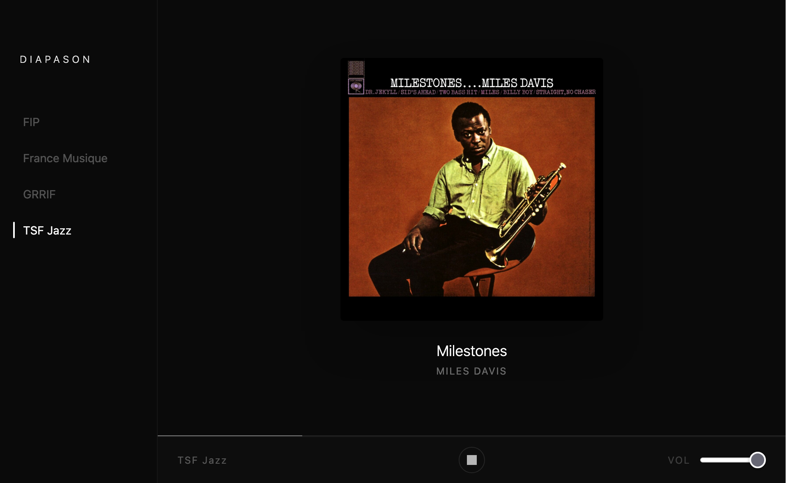

# Diapason


A minimal web radio player built with React, TypeScript, and Tailwind CSS. It streams live audio from curated stations while displaying real-time track metadata — title, artist, album, and cover art.

**[→ Open Diapason](https://dorianbourcet.github.io/diapason/)**



## Stations

- FIP
- France Musique
- TSF Jazz
- GRRIF
- ... and more to come

## Stack

- [React](https://react.dev/) + [TypeScript](https://www.typescriptlang.org/)
- [Vite](https://vitejs.dev/)
- [Tailwind CSS](https://tailwindcss.com/)
- [Zustand](https://zustand-demo.pmnd.rs/) — global state management

## Architecture

Each station has a dedicated adapter in `src/adapters/` that fetches and normalizes metadata from the station's API into a common `TrackMetadata` interface. This makes it straightforward to add new stations.

In development, API requests are proxied through Vite to avoid CORS issues. In production, a Cloudflare Worker handles the proxy.

## Development

```bash
npm install
npm run dev
```

## Lint & format

```bash
npm run lint
npm run format
```

## Deployment

The app is deployed on GitHub Pages. The proxy worker is deployed separately on Cloudflare Workers.
